# CodeBridge — Architecture Document

## Real-Time AI-Powered Pair Programming for Deaf and Hearing Developers

---

## Table of Contents

1. [Problem Statement](#1-problem-statement)
2. [Solution Overview](#2-solution-overview)
3. [Design Principles](#3-design-principles)
4. [Open-Source Ecosystem & Build vs. Reuse Map](#4-open-source-ecosystem--build-vs-reuse-map)
5. [High-Level Architecture](#5-high-level-architecture)
6. [Agent Architecture (ADK)](#6-agent-architecture-adk)
7. [Component Deep Dive](#7-component-deep-dive)
8. [Data Flow](#8-data-flow)
9. [API Contracts](#9-api-contracts)
10. [Google Cloud Infrastructure](#10-google-cloud-infrastructure)
11. [Security, Privacy & Guardrails](#11-security-privacy--guardrails)
12. [Failure Handling & Resilience](#12-failure-handling--resilience)
13. [Technology Stack](#13-technology-stack)
14. [MVP Scope vs Full Vision](#14-mvp-scope-vs-full-vision)
15. [Deployment Architecture](#15-deployment-architecture)

---

## 1. Problem Statement

### The Gap

Pair programming is the most effective form of collaborative software development. It relies
on **rapid, synchronous, high-bandwidth communication** — speaking, pointing, interrupting,
reacting in real time.

For deaf and hard-of-hearing developers, this collaboration model is fundamentally broken:

| Communication Mode | Words Per Minute | Hands Free? | Conveys Tone/Confidence? | Real-Time? |
|--------------------|-----------------|-------------|--------------------------|-----------|
| Speech (hearing)   | 125–150 WPM    | Yes         | Yes                      | Yes       |
| ASL/Sign Language  | 100–120 WPM    | No*         | Yes (facial expressions) | Yes       |
| Typing (chat)      | 40–60 WPM      | No          | No                       | Delayed   |

*Sign language requires hands, but alternates naturally with keyboard use — unlike typing for
communication which competes directly with typing for code.

### Why Existing Solutions Fail

- **Text chat (Slack, IDE chat):** Too slow, no nuance, context-poor. "Refactor that function"
  — which function? The hearing developer knows from vocal + gestural context. The reader doesn't.
- **Human interpreters:** Expensive ($50–150/hr), unavailable on-demand, rarely understand
  technical/programming jargon.
- **Generic sign language apps:** Translate signs to text, but have zero understanding of
  the code being discussed. They're modality translators, not communication bridges.
- **Auto-captions (Google Meet, Zoom):** One-directional (speech → text), no code awareness,
  no sign language input, and no context about what's on screen.

### The Core Insight

The problem isn't translation. It's **context loss**. When a hearing developer says "move that
function above the class declaration," they're combining speech + screen gaze + shared code
context. Any tool that just translates words without understanding the code context will
always produce ambiguous, incomplete communication.

---

## 2. Solution Overview

### What CodeBridge Is

CodeBridge is a **real-time, code-aware communication agent** that sits between a deaf developer
and a hearing developer during pair programming sessions. It uses Google's Gemini Live API
and Agent Development Kit (ADK) to:

1. **Listen** to the hearing developer's speech and extract intent + code references
2. **Watch** the deaf developer's camera for sign language, gestures, and pointing
3. **Understand** the shared code context (what file is open, what's highlighted, what was
   recently changed)
4. **Bridge** communication bidirectionally — converting speech to rich visual annotations for
   the deaf developer, and sign/gesture to synthesized speech for the hearing developer

### What CodeBridge Is NOT

- Not a code completion tool (not competing with Copilot/Cursor)
- Not a generic sign language translator
- Not a video calling app
- Not a code editor (it integrates with one)

### Value Proposition

> CodeBridge gives deaf developers what hearing developers take for granted: the ability to
> communicate naturally about code in real time, at full speed, with full nuance, while their
> hands stay on the keyboard.

---

## 3. Design Principles

### 3.1 Equal Participation, Not Accommodation

The deaf developer should feel like an equal participant, not a person being "helped."
The UI must be symmetrical — both developers have a rich, natural experience.

### 3.2 Code Context is King

Every piece of communication is enriched with code context. "This function" becomes
"the `authenticateUser` function at line 34 of `auth.py`." This is the core differentiator.

### 3.3 Graceful Degradation

When the Vision Agent is uncertain about a sign, it says so: "I'm 80% confident Dev B
signed 'refactor' — can you confirm?" Never hallucinate intent.

### 3.4 Low Latency Above All

Real-time communication tolerates ~1–2 seconds of latency. Beyond that, the conversational
flow breaks. Every architectural decision optimizes for latency.

### 3.5 Privacy by Default

Video streams are processed in real-time and not stored. Code context stays in the session.
No training on user data.

### 3.6 Compose, Don't Reinvent

Every component that isn't our core differentiator should be an open-source package or
managed service. We build the **glue and the intelligence** — everything else is off-the-shelf.

---

## 4. Open-Source Ecosystem & Build vs. Reuse Map

### Philosophy

CodeBridge's competitive advantage is the **Bridge Agent intelligence** — the code-aware
context fusion that no existing tool provides. Everything else (video streaming, code editing,
hand tracking, real-time sync) is solved by battle-tested open-source projects. We compose them.

### Component Mapping

| Component | Build or Reuse? | Package / Service | Why This One |
|-----------|----------------|-------------------|-------------|
| **Real-time video/audio transport** | REUSE | **LiveKit** (`livekit`, `@livekit/components-react`) | Open-source WebRTC infrastructure used by OpenAI, Spotify. Handles all signaling, room management, track subscriptions. Eliminates ~2 weeks of WebRTC plumbing. |
| **Hand landmark detection** | REUSE | **MediaPipe Hands** (`@mediapipe/tasks-vision`) | Google's own hand tracking — 21 landmarks per hand, runs client-side in browser at 30fps. We use this as a **gate**: only send video to Gemini when hands are detected and moving (saves API cost + latency). |
| **Pose & facial expression** | REUSE | **MediaPipe Holistic** (`@mediapipe/tasks-vision`) | Provides face mesh (478 landmarks) + pose (33 landmarks). ASL grammar depends heavily on facial expressions — eyebrow raise = question, head shake = negation. MediaPipe gives us this for free on-device. |
| **Code editor** | REUSE | **Monaco Editor** (`monaco-editor`, `@monaco-editor/react`) | VS Code's editor component. Syntax highlighting, IntelliSense, 50+ language support. Zero reason to build a code editor. |
| **Real-time code sync (CRDT)** | REUSE | **Yjs** (`yjs`, `y-monaco`, `y-websocket`) | Industry-standard CRDT library. `y-monaco` binding gives us Google Docs-style collaborative editing in ~20 lines of code. |
| **Agent orchestration** | REUSE | **Google ADK** (`google-adk` v1.26) | Required by hackathon. Multi-agent composition, tool registration, session management. Code-first Python framework. |
| **Gemini model access** | REUSE | **Google GenAI SDK** (`google-genai`) | Required by hackathon. Live API for streaming audio/video, multimodal understanding, speech synthesis. |
| **Backend framework** | REUSE | **FastAPI** (`fastapi`, `uvicorn`) | Async Python, native WebSocket support, automatic OpenAPI docs, Pydantic validation. |
| **State management (frontend)** | REUSE | **Zustand** (`zustand`) | Minimal, fast React state. No Redux boilerplate. |
| **Styling** | REUSE | **Tailwind CSS** (`tailwindcss`) | Utility-first CSS. Ship a beautiful UI without writing custom CSS files. |
| **Data validation** | REUSE | **Pydantic** (`pydantic` v2) | Type-safe data models shared between agents. Automatic JSON serialization. |
| **Session persistence** | REUSE | **Firestore** (managed) | Google Cloud NoSQL. Real-time listeners, serverless, zero ops. |
| **Caching / pub-sub** | REUSE | **Redis via Memorystore** (managed) | Sub-ms latency for code state cache and inter-agent message passing. |
| **Infrastructure as code** | REUSE | **Terraform** (`hashicorp/terraform`) | Declarative GCP provisioning. Reproducible deployments (bonus points). |
| **Bridge Agent intelligence** | **BUILD** | Custom (our code) | The core IP. Fuses voice intent + sign interpretation + code context into rich bidirectional communication. No existing tool does this. |
| **Code context engine** | **BUILD** | Custom (our code) | Maps deictic references ("this function", pointing gestures) to actual code entities using editor state + conversation history. Novel. |
| **Confidence & disambiguation UX** | **BUILD** | Custom (our code) | Shows alternatives when sign confidence is low, prompts for clarification. The guardrail layer. |

### How MediaPipe + Gemini Work Together (Not Redundant)

This is a critical architectural decision — we use MediaPipe and Gemini for **different things**:

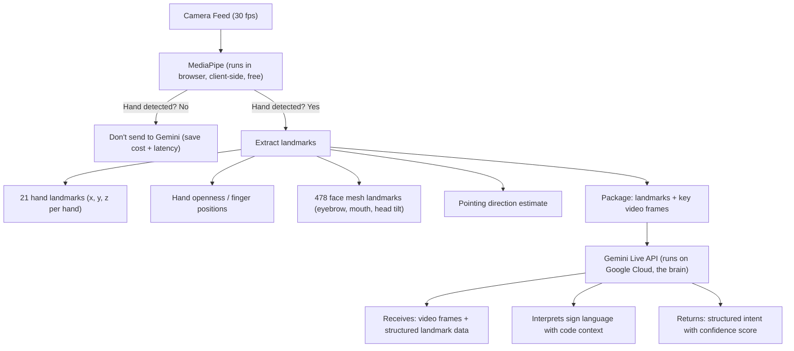

**Why this split matters:**
- MediaPipe runs at **30fps client-side for free** — perfect for continuous monitoring
- Gemini is powerful but costly per API call — we only invoke it when MediaPipe detects active signing
- MediaPipe provides **structured landmark data** that enriches Gemini's interpretation
- This reduces Gemini API calls by ~70% (idle time, typing time, etc.)

### How LiveKit Replaces Custom WebRTC

Instead of building WebSocket media transport from scratch:

```
WITHOUT LiveKit (weeks of work):
  - Build WebSocket server for binary audio/video
  - Handle codec negotiation
  - Implement room/session logic
  - Build reconnection handling
  - Handle NAT traversal, STUN/TURN
  - Build audio level detection
  - Manage track subscriptions

WITH LiveKit (hours of work):
  - livekit-server handles all transport (self-hosted or LiveKit Cloud)
  - @livekit/components-react gives us <VideoTrack>, <AudioTrack>, room UI
  - livekit Python SDK lets backend subscribe to tracks for agent processing
  - Built-in reconnection, room events, participant management
  - We focus 100% on the agent intelligence layer
```

### How Yjs + Monaco Replaces Custom Sync

```
WITHOUT Yjs (weeks of work):
  - Build Operational Transform or CRDT from scratch
  - Handle conflict resolution
  - Build cursor presence protocol
  - Sync editor state over WebSocket

WITH Yjs (20 lines of code):
  const ydoc = new Y.Doc()
  const ytext = ydoc.getText('code')
  const provider = new WebsocketProvider(wsUrl, roomId, ydoc)
  const binding = new MonacoBinding(ytext, editor.getModel(), new Set([editor]), provider.awareness)
  // Done. Real-time collaborative editing works.
```

---

## 5. High-Level Architecture

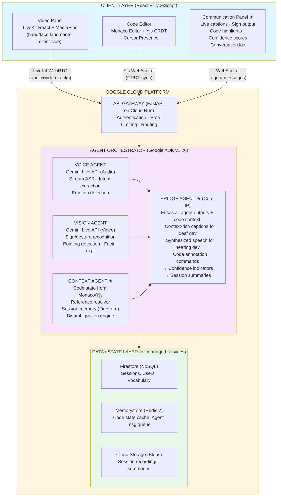

> ★ = Custom code (our IP). Everything else is open-source or managed service.

---

## 6. Agent Architecture (ADK — google-adk v1.26)

CodeBridge uses Google's Agent Development Kit (ADK) to orchestrate a multi-agent system.
Each agent has a single responsibility and communicates through the Bridge Agent.

### 6.1 Voice Agent

**Purpose:** Process the hearing developer's audio stream in real time.

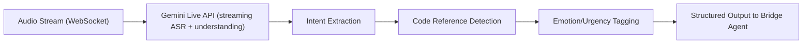

**Output Schema:**
```json
{
  "type": "voice_intent",
  "timestamp": "2026-03-10T14:30:00.123Z",
  "speaker": "hearing_dev",
  "transcript": "Can you refactor this function to use async await?",
  "intent": "refactor_request",
  "code_references": [
    {
      "type": "unresolved",
      "phrase": "this function",
      "requires_context": true
    }
  ],
  "emotion": {
    "tone": "collaborative",
    "urgency": "normal"
  },
  "confidence": 0.94
}
```

### 6.2 Vision Agent

**Purpose:** Interpret the deaf developer's camera feed for sign language, gestures, and pointing.

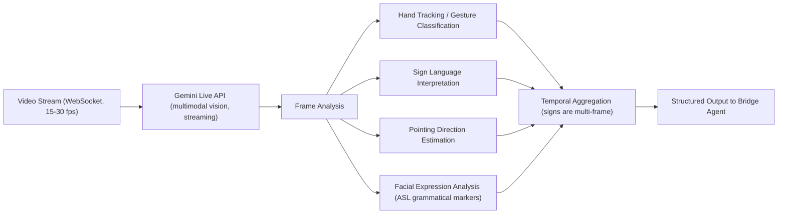

**Output Schema:**
```json
{
  "type": "vision_intent",
  "timestamp": "2026-03-10T14:30:02.456Z",
  "speaker": "deaf_dev",
  "interpretation": "I think we should rename this variable",
  "raw_signs": ["I", "THINK", "RENAME", "POINT_AT_SCREEN"],
  "gestures": [
    {
      "type": "pointing",
      "direction": "screen_upper_left",
      "estimated_target": "requires_context_resolution"
    }
  ],
  "facial_expression": {
    "grammatical_marker": "suggestion",
    "intensity": "moderate"
  },
  "confidence": 0.78,
  "alternatives": [
    {
      "interpretation": "I think we should remove this variable",
      "confidence": 0.15
    }
  ]
}
```

### 6.3 Context Agent

**Purpose:** Maintain awareness of the shared code state and resolve ambiguous references.

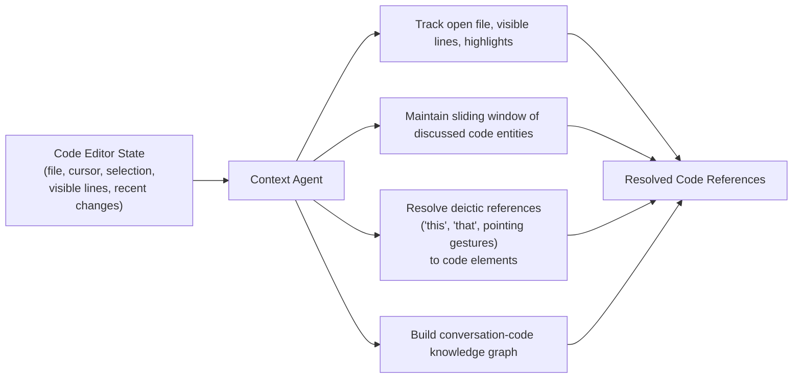

**Resolution Example:**
```json
{
  "type": "context_resolution",
  "request": {
    "phrase": "this function",
    "pointing_direction": "screen_upper_left"
  },
  "resolution": {
    "entity": "function",
    "name": "authenticateUser",
    "file": "src/auth/handler.py",
    "line_range": [34, 67],
    "confidence": 0.91,
    "reasoning": "Function visible in upper portion of editor, most recently discussed entity"
  }
}
```

### 6.4 Bridge Agent (Orchestrator)

**Purpose:** Fuse outputs from all agents and produce final bidirectional communication.

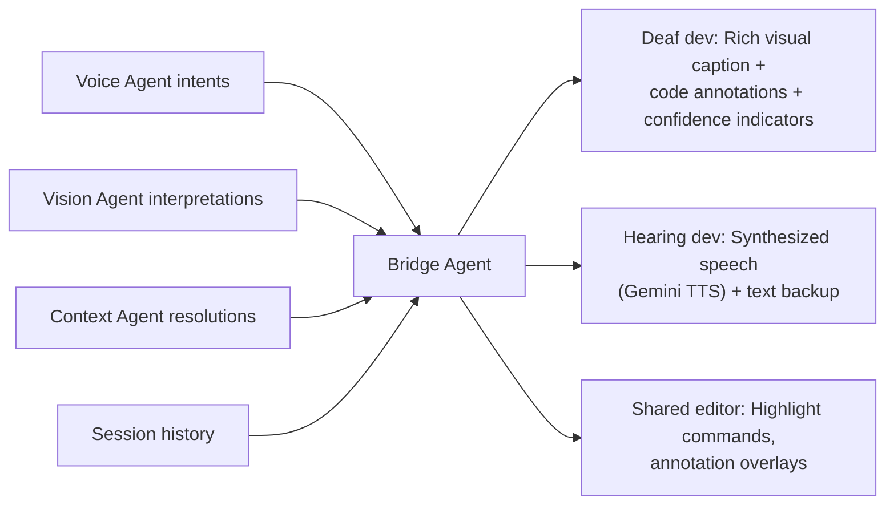

**Fusion Logic:**
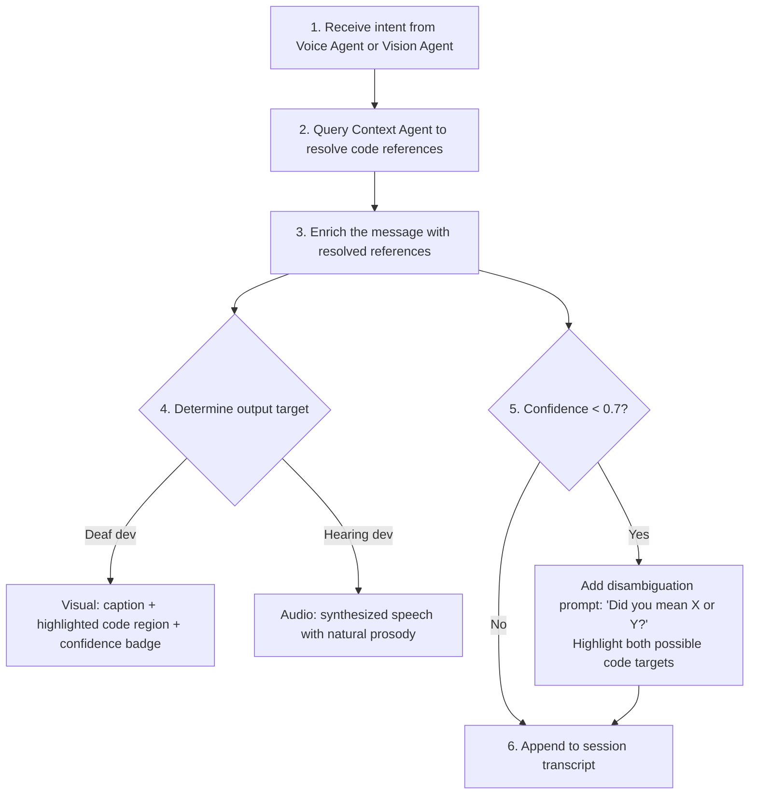

**ADK Agent Definition (Pseudocode):**
```python
from google.adk import Agent, Tool, Orchestrator

bridge_agent = Orchestrator(
    name="bridge_agent",
    description="Fuses multimodal inputs to bridge deaf-hearing communication",
    sub_agents=[voice_agent, vision_agent, context_agent],
    routing_strategy="parallel_merge",
    model="gemini-2.5-pro",
    tools=[
        code_highlight_tool,
        speech_synthesis_tool,
        caption_generator_tool,
        session_memory_tool,
    ],
    system_instruction="""
    You are CodeBridge, a communication agent bridging a deaf developer and a
    hearing developer during pair programming. Your job is to:
    1. Fuse voice input, sign language input, and code context
    2. Produce rich, context-aware communication for both parties
    3. When uncertain, say so — never hallucinate intent
    4. Treat both developers as equal participants
    """
)
```

### 6.5 Agent Communication Flow

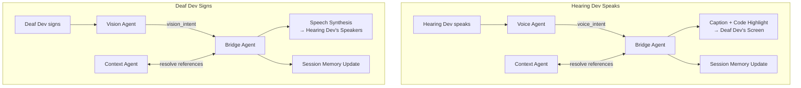

---

## 7. Component Deep Dive

### 7.1 Frontend (React + TypeScript)

```
src/
├── components/
│   ├── VideoPanel/
│   │   ├── CameraFeed.tsx          # WebRTC camera with overlay
│   │   ├── SoundVisualizer.tsx     # Visual representation of audio for deaf dev
│   │   ├── SignDetectionOverlay.tsx # Bounding box on detected signs
│   │   └── SpeakerIndicator.tsx    # Who is currently communicating
│   │
│   ├── CodeEditor/
│   │   ├── SharedEditor.tsx        # Monaco editor with CRDT sync
│   │   ├── CodeHighlighter.tsx     # Agent-driven code highlighting
│   │   ├── AnnotationOverlay.tsx   # Inline annotations from agent
│   │   └── CursorPresence.tsx      # Show both developers' cursors
│   │
│   ├── CommunicationPanel/
│   │   ├── LiveCaptions.tsx        # Real-time captions with code refs
│   │   ├── SignInterpretation.tsx   # What the vision agent interpreted
│   │   ├── ConfidenceBadge.tsx     # Visual confidence indicator
│   │   ├── ConversationLog.tsx     # Scrollable history
│   │   └── DisambiguationPrompt.tsx# "Did you mean X or Y?"
│   │
│   └── SessionControls/
│       ├── SessionManager.tsx      # Start/end/configure session
│       ├── AccessibilitySettings.tsx# Font size, contrast, caption speed
│       └── SessionSummary.tsx      # Post-session summary view
│
├── services/
│   ├── websocket.ts               # WebSocket connection manager
│   ├── webrtc.ts                  # Media stream handling
│   ├── codeSync.ts                # CRDT-based code synchronization
│   └── agentClient.ts            # Communication with backend agents
│
├── hooks/
│   ├── useMediaStream.ts          # Camera/microphone access
│   ├── useAgentMessages.ts        # Subscribe to agent outputs
│   ├── useCodeContext.ts          # Track editor state for context agent
│   └── useAccessibility.ts       # User accessibility preferences
│
└── stores/
    ├── sessionStore.ts            # Session state (Zustand)
    ├── codeStore.ts               # Shared code state
    └── communicationStore.ts      # Message history
```

### 7.2 Backend Services (Cloud Run)

```
backend/
├── gateway/
│   ├── main.py                    # FastAPI entry point
│   ├── auth.py                    # Session authentication
│   ├── ws_handler.py              # WebSocket endpoint management
│   └── rate_limiter.py            # Request rate limiting
│
├── agents/
│   ├── orchestrator.py            # ADK Bridge Agent definition
│   ├── voice_agent.py             # ADK Voice Agent definition
│   ├── vision_agent.py            # ADK Vision Agent definition
│   ├── context_agent.py           # ADK Context Agent definition
│   └── tools/
│       ├── code_highlight.py      # Tool: send highlight commands to editor
│       ├── speech_synthesis.py    # Tool: generate speech via Gemini
│       ├── caption_generator.py   # Tool: format rich captions
│       ├── reference_resolver.py  # Tool: resolve code references
│       └── session_memory.py      # Tool: read/write session history
│
├── services/
│   ├── media_processor.py         # Audio/video stream preprocessing
│   ├── code_state_tracker.py      # Track and index code editor state
│   ├── session_manager.py         # Session lifecycle management
│   └── summary_generator.py       # Post-session summary generation
│
└── models/
    ├── intents.py                 # Voice/Vision intent data models
    ├── code_context.py            # Code reference data models
    └── session.py                 # Session data models
```

---

## 8. Data Flow

### 8.1 Hearing Developer Speaks → Deaf Developer Sees

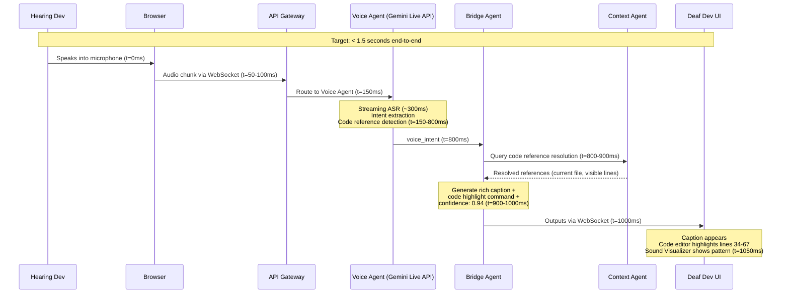

### 8.2 Deaf Developer Signs → Hearing Developer Hears

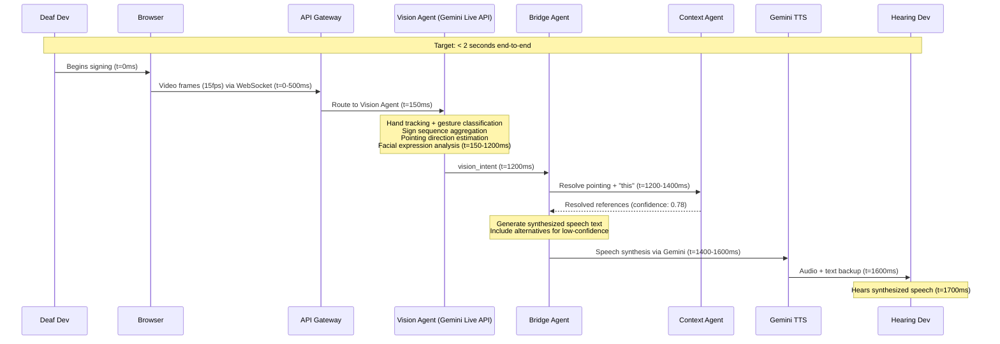

---

## 9. API Contracts

### 9.1 WebSocket Channels

Each session establishes three WebSocket connections:

| Channel | Path | Direction | Payload |
|---------|------|-----------|---------|
| Media | `/ws/media/{session_id}` | Client → Server | Audio chunks (PCM 16-bit) + Video frames (JPEG) |
| Code | `/ws/code/{session_id}` | Bidirectional | CRDT operations (Yjs) |
| Agent | `/ws/agent/{session_id}` | Server → Client | Agent messages (JSON) |

### 9.2 Agent Message Types

```typescript
// Server → Client message types

interface CaptionMessage {
  type: "caption";
  speaker: "hearing_dev" | "deaf_dev";
  text: string;
  code_references: CodeReference[];
  confidence: number;
  timestamp: string;
}

interface CodeHighlightMessage {
  type: "code_highlight";
  file: string;
  line_start: number;
  line_end: number;
  style: "reference" | "suggestion" | "warning";
  label?: string;
  duration_ms: number;
}

interface DisambiguationMessage {
  type: "disambiguation";
  question: string;
  options: {
    label: string;
    code_reference?: CodeReference;
    confidence: number;
  }[];
}

interface SessionSummaryMessage {
  type: "session_summary";
  duration_minutes: number;
  topics_discussed: string[];
  decisions_made: string[];
  action_items: string[];
  code_changes_discussed: CodeChange[];
}

interface CodeReference {
  entity_type: "function" | "variable" | "class" | "line_range" | "file";
  name: string;
  file: string;
  line_range: [number, number];
}
```

### 9.3 REST Endpoints

| Method | Path | Purpose |
|--------|------|---------|
| POST | `/api/sessions` | Create a new pair programming session |
| GET | `/api/sessions/{id}` | Get session metadata |
| POST | `/api/sessions/{id}/end` | End session, trigger summary |
| GET | `/api/sessions/{id}/summary` | Retrieve session summary |
| POST | `/api/sessions/{id}/feedback` | Submit correction for sign interpretation |
| GET | `/api/users/{id}/vocabulary` | Get custom sign vocabulary |
| PUT | `/api/users/{id}/vocabulary` | Update custom sign vocabulary |

---

## 10. Google Cloud Infrastructure

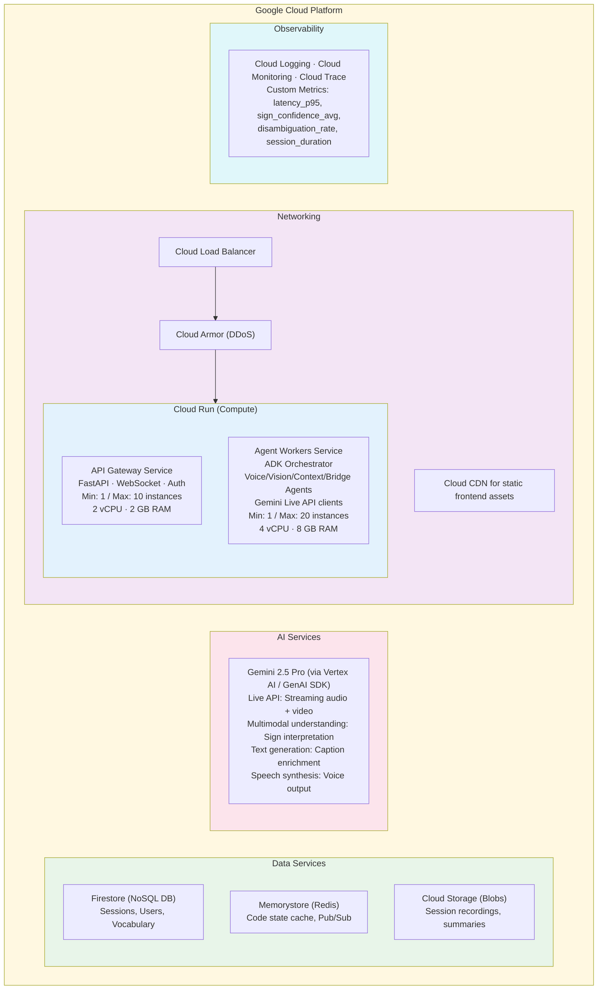

### Google Cloud Services Used

| Service | Purpose | Justification |
|---------|---------|---------------|
| **Cloud Run** | Serverless compute for API + agents | Auto-scaling, WebSocket support, cost-effective |
| **Firestore** | Session/user data | Real-time sync, serverless, no ops |
| **Memorystore (Redis)** | Code state cache, message queue | Sub-millisecond latency for real-time features |
| **Cloud Storage** | Session recordings, summaries | Durable blob storage |
| **Vertex AI / GenAI SDK** | Gemini model access | Required by hackathon |
| **Cloud Load Balancer** | Traffic routing | WebSocket support, SSL termination |
| **Cloud Armor** | DDoS protection | Security requirement |
| **Cloud Logging + Monitoring** | Observability | Debugging, performance tracking |
| **Secret Manager** | API keys, credentials | Secure credential storage |
| **Artifact Registry** | Container images | CI/CD for Cloud Run deployments |

---

## 11. Security, Privacy & Guardrails

### 11.1 Data Privacy

| Data Type | Stored? | Duration | Encryption |
|-----------|---------|----------|------------|
| Video stream | **No** | Real-time processing only | TLS in transit |
| Audio stream | **No** | Real-time processing only | TLS in transit |
| Code content | Session cache only | Deleted after session ends | AES-256 at rest |
| Conversation transcript | Optional (user consent) | 30 days | AES-256 at rest |
| Session summary | Yes (user consent) | Until deleted by user | AES-256 at rest |
| User profile | Yes | Until account deletion | AES-256 at rest |

### 11.2 Agent Guardrails

```python
GUARDRAIL_CONFIG = {
    "sign_interpretation": {
        "min_confidence_to_speak": 0.70,
        "min_confidence_to_act": 0.85,
        "always_show_alternatives_below": 0.80,
        "max_consecutive_low_confidence": 3,
        "action_on_max_low_confidence": "prompt_for_text_input"
    },
    "code_actions": {
        "agent_can_highlight": True,
        "agent_can_edit_code": False,       # NEVER auto-edit
        "agent_can_suggest_edits": True,
        "require_confirmation_for": ["file_operations", "git_operations"]
    },
    "content_safety": {
        "filter_profanity": False,           # Developers swear; don't censor
        "detect_frustration": True,          # Offer help if session is going badly
        "prevent_pii_in_summaries": True     # Strip names/emails from stored summaries
    },
    "session_limits": {
        "max_duration_hours": 4,
        "warn_at_minutes": [60, 120, 180],
        "max_participants": 2                # MVP: pair programming only
    }
}
```

### 11.3 Authentication

- Session-based authentication with short-lived tokens
- Both developers must authenticate before joining a session
- WebSocket connections authenticated via token in initial handshake
- No OAuth complexity for MVP — simple invite-link model

---

## 12. Failure Handling & Resilience

### 12.1 Failure Modes and Recovery

| Failure | Detection | Recovery | User Experience |
|---------|-----------|----------|----------------|
| Gemini API timeout | 3-second timeout | Retry with exponential backoff (max 2 retries) | Caption shows "..." indicator, catches up when restored |
| WebSocket disconnect | Heartbeat miss (5s) | Auto-reconnect with session resumption | "Reconnecting..." banner, session state preserved |
| Low sign confidence streak | 3+ consecutive < 0.5 confidence | Prompt deaf dev to switch to text input temporarily | "I'm having trouble reading your signs. Would you like to type for a moment?" |
| Code state desync | CRDT conflict detection | Force resync from most recent consistent state | Brief flicker, no data loss |
| Agent crash | Health check failure | Cloud Run auto-restarts, session reconnects to new instance | ~5 second interruption, session resumes |

### 12.2 Graceful Degradation Ladder

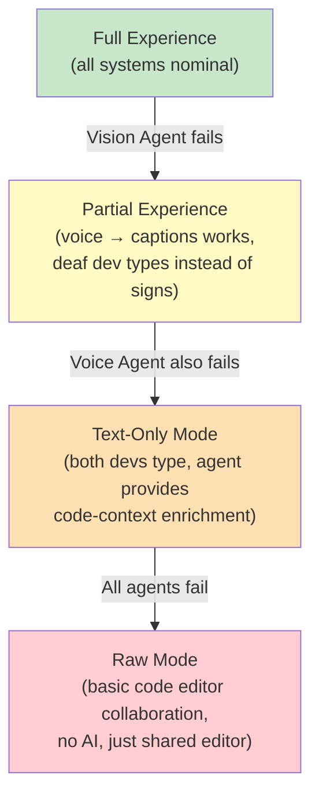

Every degradation level is still usable. The session never fully breaks.

---

## 13. Technology Stack

### Frontend — All Open-Source

| Package | npm Install | What It Solves For Us | Lines of Custom Code Saved |
|---------|------------|----------------------|---------------------------|
| `react` + `react-dom` 19.x | `npm i react react-dom` | UI framework | — |
| `typescript` 5.x | `npm i -D typescript` | Type safety | — |
| `@monaco-editor/react` | `npm i @monaco-editor/react` | Full code editor with syntax highlighting, IntelliSense | ~5,000+ |
| `yjs` + `y-monaco` + `y-websocket` | `npm i yjs y-monaco y-websocket` | Real-time collaborative editing via CRDT | ~3,000+ |
| `@livekit/components-react` + `livekit-client` | `npm i @livekit/components-react livekit-client` | WebRTC video/audio rooms, track management, reconnection | ~8,000+ |
| `@mediapipe/tasks-vision` | `npm i @mediapipe/tasks-vision` | Client-side hand tracking (21 landmarks), face mesh (478 landmarks) | ~2,000+ |
| `zustand` 5.x | `npm i zustand` | Lightweight state management | ~500 |
| `tailwindcss` 4.x | `npm i -D tailwindcss` | Utility-first styling | — |

### Backend — All Open-Source

| Package | pip Install | What It Solves For Us | Lines of Custom Code Saved |
|---------|------------|----------------------|---------------------------|
| `python` 3.12+ | — | Runtime | — |
| `google-adk` 1.26 | `pip install google-adk` | Multi-agent orchestration, tool registry, session management | ~4,000+ |
| `google-genai` | `pip install google-genai` | Gemini Live API access (streaming audio/video), multimodal understanding | ~2,000+ |
| `fastapi` + `uvicorn` | `pip install fastapi uvicorn` | Async HTTP + WebSocket server with auto-generated OpenAPI docs | ~1,500+ |
| `pydantic` 2.x | `pip install pydantic` | Type-safe data models, automatic JSON serialization | ~500 |
| `livekit` + `livekit-api` | `pip install livekit livekit-api` | Server-side track subscription for agent audio/video processing | ~2,000+ |
| `redis` (via `redis-py`) | `pip install redis` | Code state caching, inter-agent pub/sub | ~300 |
| `google-cloud-firestore` | `pip install google-cloud-firestore` | Session persistence, user profiles | ~400 |

### Infrastructure

| Technology | Install | What It Solves For Us |
|-----------|---------|----------------------|
| Docker | — | Containerization for Cloud Run |
| Terraform | `brew install terraform` | Infrastructure as code (GCP provisioning in ~200 lines) |
| Cloud Build | GCP managed | CI/CD pipeline — zero custom scripting |
| LiveKit Server | Docker image `livekit/livekit-server` | Self-hosted WebRTC SFU (or use LiveKit Cloud free tier for hackathon) |

### What We Actually Write (Our Custom Code)

| Component | Est. Lines | Purpose |
|-----------|-----------|---------|
| Bridge Agent logic | ~400 | Fuse voice + vision + code context into bidirectional output |
| Context Engine | ~300 | Map deictic references to code entities using editor state |
| MediaPipe → Gemini pipeline | ~150 | Gate and enrich video frames before sending to Gemini |
| Communication Panel UI | ~500 | Captions, confidence badges, disambiguation prompts |
| Session management glue | ~200 | Connect LiveKit rooms to ADK agents to Yjs docs |
| Agent tool definitions | ~250 | ADK tools for highlighting, captioning, speech synthesis |
| **Total custom code** | **~1,800** | **Everything else is open-source** |

---

## 14. MVP Scope vs Full Vision

### MVP (Hackathon Demo — 12 Days)

| Feature | Priority | Status |
|---------|----------|--------|
| Gemini Live API audio processing (hearing dev → captions) | P0 | Must ship |
| Gemini Vision sign/gesture interpretation (deaf dev → speech) | P0 | Must ship |
| Shared Monaco code editor | P0 | Must ship |
| Code-context-aware reference resolution | P0 | Must ship |
| Bridge Agent orchestration via ADK | P0 | Must ship |
| Rich visual captions with code highlights | P0 | Must ship |
| Confidence indicators + disambiguation prompts | P1 | Should ship |
| Session summary generation | P1 | Should ship |
| Sound visualizer for deaf dev | P1 | Should ship |
| Cloud Run deployment + Terraform | P1 | Should ship (bonus points) |
| Custom sign vocabulary | P2 | If time allows |
| Multilingual support | P2 | If time allows |
| Session recording (opt-in) | P2 | If time allows |

### Full Vision (Post-Hackathon)

- Support for 3+ participants (mob programming)
- IDE plugin (VS Code extension) instead of web-only
- Offline sign vocabulary training per user
- Integration with Jira/Linear for action item creation
- Support for multiple sign languages (BSL, LSF, JSL)
- Mobile companion app for on-the-go code review

---

## 15. Deployment Architecture

### Infrastructure as Code (Terraform)

```
infrastructure/
├── main.tf                 # Provider config, backend
├── cloud_run.tf            # API Gateway + Agent Worker services
├── firestore.tf            # Database setup
├── memorystore.tf          # Redis instance
├── storage.tf              # Cloud Storage buckets
├── networking.tf           # VPC, Load Balancer, Cloud Armor
├── iam.tf                  # Service accounts, permissions
├── secrets.tf              # Secret Manager entries
├── monitoring.tf           # Dashboards, alerts
├── variables.tf            # Configurable parameters
└── outputs.tf              # Deployment URLs, connection strings
```

### Deployment Pipeline

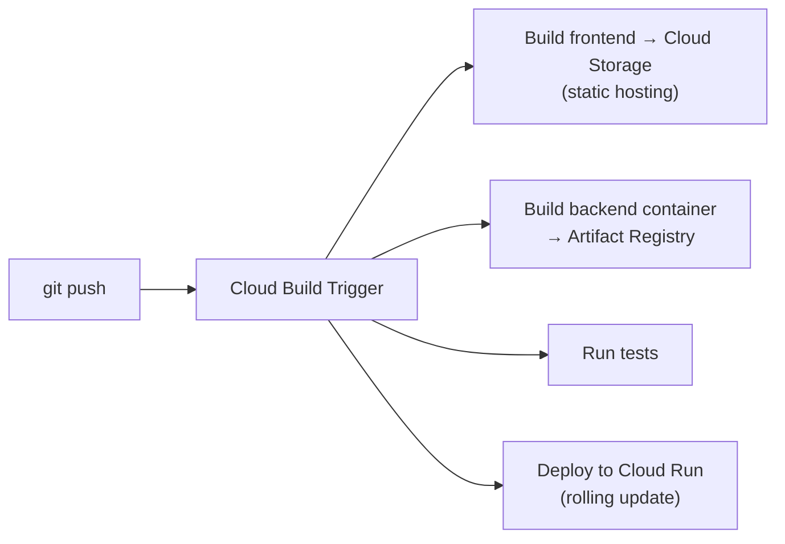

### Environment Configuration

| Environment | Purpose | Gemini Model | Cloud Run Instances |
|-------------|---------|-------------|-------------------|
| `dev` | Development/testing | gemini-2.5-flash | 1 (min/max) |
| `prod` | Demo / hackathon judges | gemini-2.5-pro | 1-5 (auto-scale) |

---

## Appendix A: Key Metrics to Track

| Metric | Target | Why It Matters |
|--------|--------|----------------|
| End-to-end voice → caption latency | < 1.5s | Conversational flow |
| End-to-end sign → speech latency | < 2.0s | Natural communication |
| Sign interpretation confidence (avg) | > 0.75 | Quality of deaf dev experience |
| Disambiguation rate | < 20% | Agent should be right most of the time |
| Session duration (avg) | > 15 min | People actually use it for real work |
| Code reference resolution accuracy | > 85% | Core differentiator must work |

---

## Appendix B: Accessibility Considerations

- All UI elements meet WCAG 2.1 AA contrast ratios
- Captions use a clear, large sans-serif font (configurable size)
- Code highlights use patterns + colors (not color alone) for color-blind users
- Keyboard navigable — no mouse-only interactions
- Screen reader compatible for any text elements
- High-contrast mode toggle
- Caption background opacity is adjustable

---

*Document Version: 1.1 — Updated with open-source composition strategy*
*Last Updated: March 4, 2026*
*Project: CodeBridge — Gemini Live Agent Challenge*
